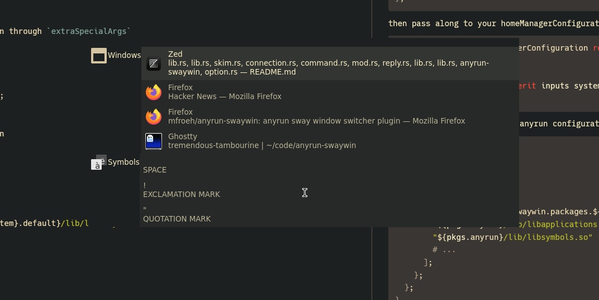

# Anyrun Sway Window Switcher
Anyrun plugin for switching sway windows.


## Home-manager usage
Declare as input to your flake
```nix
inputs.anyrun-swaywin = {
  url = "github:mfroeh/anyrun-swaywin";
  inputs.nixpkgs.follows = "nixpkgs";
};
```
then pass along to your homeManagerConfiguration through `extraSpecialArgs`
```nix
home-manager.lib.homeManagerConfiguration rec {
  # ...
  system = "x86_64-linux";
  extraSpecialArgs = { inherit inputs system; };
}
```
and add as a plugin to your anyrun configuration
```nix
{ inputs, pkgs, ... }: {
  programs.anyrun = {
    enable = true;
    config = {
      plugins = [
        "${inputs.anyrun-swaywin.packages.${system}.default}/lib/libswaywin.so"
        "${pkgs.anyrun}/lib/libapplications.so"
        "${pkgs.anyrun}/lib/libsymbols.so"
        # ...
      ];
    };
  };
}
```

## Usage outside home-manager
Untested, but you should be able to just `cargo build --release` the shared library and then add it to your `~/.config/anyrun/config.ron` plugins